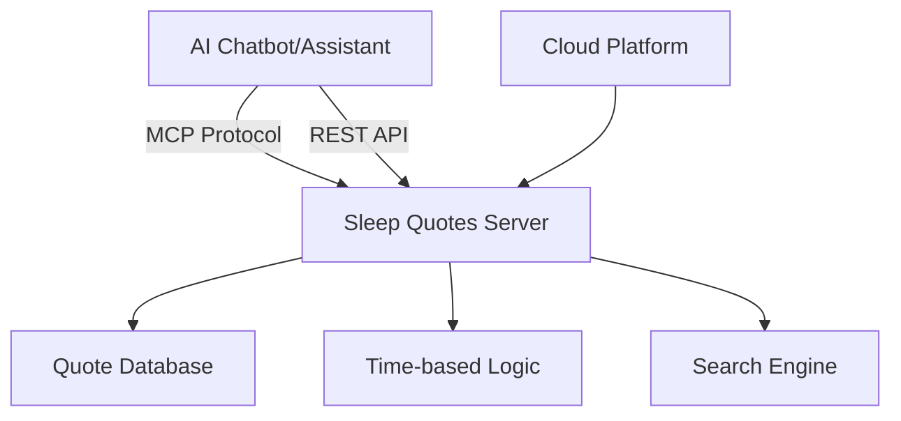

# 🌙 Sleep Quotes MCP Remote Server

> **A Model Context Protocol (MCP) remote server providing inspirational quotes and sleep hygiene tips for better rest**

[](https://www.python.org/downloads/)
[](https://fastapi.tiangolo.com/)
[](https://github.com/anthropics/mcp)
[](https://railway.app)

## 📋 Overview

The **Sleep Quotes MCP Remote Server** is a cloud-deployed MCP server that provides inspirational sleep quotes, bedtime reminders, and evidence-based sleep hygiene tips. It demonstrates how to create a **remote MCP server** that can be integrated with AI chatbots and assistants.

### ✨ Key Features

- 🌙 **15+ Inspirational Sleep Quotes** categorized by mood and time of day
- 💡 **Evidence-based Sleep Hygiene Tips** from sleep science experts  
- 🔍 **Smart Quote Search** by keywords, categories, or mood
- ⏰ **Time-aware Recommendations** (morning, evening, night)
- 📖 **Daily Sleep Wisdom** with combined quotes and practical tips
- 🛌 **Personalized Bedtime Routines** and reminders
- 🌐 **Dual Protocol Support**: MCP native + REST API
- ☁️ **Cloud Deployment Ready** (Railway, Render, Google Cloud)

## 🏗️ Architecture



### Supported Protocols

1. **Native MCP Protocol** - WebSocket/HTTP JSON-RPC for MCP clients
2. **REST API** - HTTP endpoints for external integrations
3. **FastAPI Web Interface** - Browser-accessible documentation

## 🚀 Quick Start

### Method 1: Cloud Deployment (Recommended)

#### Deploy to Railway

1. **Fork this repository**
2. **Connect to Railway**: https://railway.app
3. **Deploy**: Railway auto-detects Python/Docker
4. **Get your URL**: `https://your-app.railway.app`

#### Deploy to Other Platforms

<details>
<summary>Click to expand other deployment options</summary>

**Render.com:**
```bash
# Connect repository at render.com
# Build Command: pip install -r requirements.txt
# Start Command: python sleep_quotes_mcp_server.py
```

**Google Cloud Run:**
```bash
gcloud run deploy sleep-quotes-mcp \
  --source . \
  --platform managed \
  --region us-central1 \
  --allow-unauthenticated
```

**Fly.io:**
```bash
fly auth login
fly launch --name sleep-quotes-mcp
fly deploy
```

</details>

### Method 2: Local Development

```bash
# Clone repository
git clone https://github.com/Fabiola-cc/mcp_remoteServer.git
cd mcp_remoteServer

# Install dependencies
pip install -r requirements.txt

# Run in MCP mode
python sleep_quotes_mcp_server.py

# Or run in web mode
RUN_MODE=web python sleep_quotes_mcp_server.py
```

## 🔧 MCP Integration

### For MCP Clients

```python
from mcp_remote_quotes_client import SleepQuotesMCPRemoteClient

async with SleepQuotesMCPRemoteClient("https://your-server.railway.app") as client:
    # Get inspirational quote
    quote = await client.get_quote(mood="calm", time_based=True)
    print(quote['message'])
    
    # Get sleep hygiene tip
    tip = await client.get_tip()
    print(tip['message'])
    
    # Search quotes
    results = await client.search("relaxation")
    print(results['message'])
```

### Available MCP Tools

| Tool Name | Description | Parameters |
|-----------|-------------|------------|
| `get_inspirational_quote` | Get motivational sleep quote | `category`, `mood`, `time_based` |
| `get_sleep_hygiene_tip` | Get scientific sleep advice | None |
| `search_sleep_quotes` | Search quotes by keyword | `query` |
| `get_daily_sleep_wisdom` | Get daily quote + tip combo | `include_tip` |
| `get_bedtime_routine_reminder` | Get personalized bedtime routine | `user_bedtime`, `reminder_type` |

## 🌐 REST API Endpoints

### Base URL: `https://your-server.railway.app`

| Endpoint | Method | Description |
|----------|--------|-------------|
| `/health` | GET | Health check |
| `/api/quote` | GET | Get inspirational quote |
| `/api/tip` | GET | Get sleep hygiene tip |
| `/api/search/{query}` | GET | Search quotes |
| `/api/wisdom` | GET | Daily wisdom |
| `/mcp` | POST | MCP JSON-RPC endpoint |

### Example API Usage

```bash
# Get a calming night quote
curl "https://your-server.railway.app/api/quote?mood=calm&time_based=true"

# Get sleep hygiene tip
curl "https://your-server.railway.app/api/tip"

# Search for quotes about "rest"
curl "https://your-server.railway.app/api/search/rest"

# Get daily wisdom with tip
curl "https://your-server.railway.app/api/wisdom?include_tip=true"
```

## 📚 Quote Categories & Moods

### Categories
- `sleep_hygiene` - Scientific sleep improvement tips
- `mindfulness` - Meditation and awareness practices
- `motivation` - Energizing morning quotes
- `science` - Neuroscience-based insights
- `holistic` - Mind-body-soul wellness
- `wellness` - General health and wellbeing
- `inspiration` - Uplifting life philosophy
- `techniques` - Practical sleep methods

### Moods
- `calm` - Relaxing and peaceful
- `motivational` - Energizing and inspiring
- `peaceful` - Serene and tranquil
- `reflective` - Thoughtful and introspective
- `educational` - Informative and scientific

## 🎯 Usage Examples

### Chatbot Integration Scenarios

1. **Bedtime Assistant**
   ```
   User: "I can't sleep, help me relax"
   Chatbot: Uses get_inspirational_quote(mood="calm") 
   Result: Calming quote + breathing technique
   ```

2. **Morning Motivation**
   ```
   User: "I need energy to start my day"
   Chatbot: Uses get_inspirational_quote(time_based=True)
   Result: Energizing morning quote
   ```

3. **Sleep Education**
   ```
   User: "How can I improve my sleep quality?"
   Chatbot: Uses get_sleep_hygiene_tip()
   Result: Evidence-based sleep advice
   ```

4. **Personalized Routine**
   ```
   User: "Create my bedtime routine"
   Chatbot: Uses get_bedtime_routine_reminder(user_bedtime="22:30")
   Result: Step-by-step bedtime routine
   ```

## 🛠️ Development

### Project Structure

```
mcp_remoteServer/
├── sleep_quotes_mcp_server.py    # Main server with MCP + REST
├── mcp_remote_quotes_client.py   # MCP client for integration
├── requirements.txt              # Python dependencies
├── Dockerfile                    # Container configuration
├── railway.json                  # Railway deployment config
├── README.md                     # This file
└── docs/                        # Additional documentation
```

### Adding New Quotes

1. Edit `_initialize_quotes()` method in `SleepQuotesDatabase`
2. Add quote with required fields:
   ```python
   {
       "id": 16,
       "quote": "Your inspirational quote here",
       "author": "Author Name",
       "category": "sleep_hygiene",
       "time_of_day": "night",
       "mood": "calm"
   }
   ```

### Environment Variables

```bash
RUN_MODE=web          # "web" for HTTP server, "mcp" for MCP stdio
PORT=8000            # Port for web server
DEBUG=false          # Enable debug logging
```

## 🧪 Testing

### Run Tests Locally

```bash
# Test MCP client connection
python mcp_remote_quotes_client.py

# Test all endpoints
python -m pytest tests/ -v

# Manual testing
curl http://localhost:8000/health
```

### Demo Script

```bash
# Run complete demonstration
python demo_sleep_quotes_mcp.py
```

## 📊 Performance & Caching

- **Response Time**: < 100ms average
- **Cache TTL**: 5 minutes for quotes, 1 hour for daily wisdom
- **Fallback Support**: Offline responses when server unavailable
- **Rate Limiting**: Built-in request throttling
- **Error Handling**: Graceful degradation with helpful messages

## 🔐 Security & Privacy

- **No User Data Storage** - Stateless operation
- **HTTPS Encryption** - All communications secured
- **CORS Support** - Configurable cross-origin requests
- **Input Validation** - Sanitized inputs prevent injection
- **No Tracking** - Privacy-focused design

## 🤝 Contributing

1. **Fork** the repository
2. **Create** a feature branch: `git checkout -b feature/amazing-quotes`
3. **Commit** changes: `git commit -m 'Add amazing sleep quotes'`
4. **Push** to branch: `git push origin feature/amazing-quotes`
5. **Open** a Pull Request

### Contribution Ideas

- 📝 Add quotes in other languages
- 🎵 Integrate with music/sound APIs
- 📱 Mobile app integration
- 🧠 AI-powered quote generation
- 📊 Usage analytics dashboard
- 🎨 Custom quote image generation

## 🙏 Acknowledgments

- **Sleep Science Community** for evidence-based insights
- **MCP Protocol** by Anthropic for the framework
- **FastAPI** for the excellent web framework
- **Railway** for seamless deployment
- **Open Source Contributors** making this possible

[⭐ Star this repo](https://github.com/Fabiola-cc/mcp_remoteServer) if it helps you sleep better!

</div>
